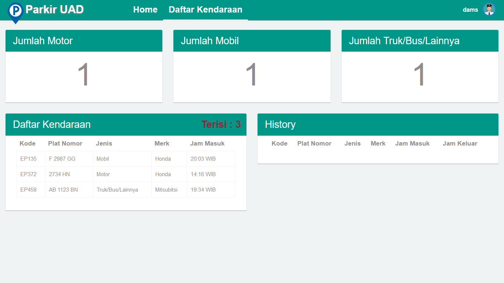

# Parkir-UAD
Sistem Parkir berbasis Web dengan adanya pencatatan dan penyimpanan proses keluar dan masuk kendaraan dengan cepat, tepat dan lebih efisien. serta dapat mempermudahkan petugas untuk mengakses dan mengelola data masuk dan keluar kendaraan di lingkungan kampus.

To access admin page, add url /admin. Example http://localhost/parkir-uad/index.php

# Tampilan Aplikasi
## Tampilan Login Admin

## Tampilan Homepage Admin

## Tampilan Login Petugas Parkir

## Tampilan Homepage Petugas

## Tampilan Daftar Kendaraan

## Tampilan Print Karcis Parkir 

## Login Account
|   Level   | Username    | Password   |
|:---------:|:---------:  |-----------:|
| Admin     | mamoy       | 12345      |
| Petugas   | dams        | 12345      |

## Sistem Requirement
- Database MySQL
- XAMPP / PHP 5.6
